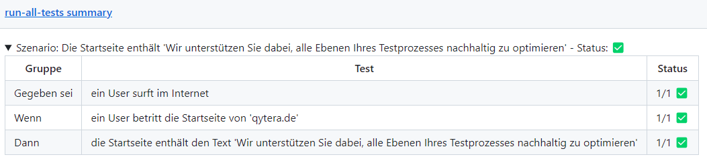

# K6 Minimal Example

This repository provides a minimal example of using K6 for API and performance testing. It includes test scripts, configuration files, and automation workflows to facilitate testing with K6 in a Behavior-Driven Development (BDD) style.

## Behavior-Driven Development (BDD) Style

The test scripts in this repository are written in a BDD style using custom BDD functions (`scenario`, `given`, `when`, `then`). BDD focuses on creating simple scenarios that describe the behavior of the system from the end user's perspective.

### Scenario

A scenario describes a specific situation or behavior that you want to test. It outlines the context and the expected outcome.

### Given

The `Given` step sets up the initial context or state of the system before the action occurs. It describes the preconditions for the scenario.

### When

The `When` step specifies the action or event that triggers the behavior you want to test. It defines what happens when the user performs a specific action.

### Then

The `Then` step describes the expected outcome or result after the action is performed. It verifies that the system behaves as expected.

### Example

Here is an example of a BDD-style test script using K6:

```javascript
import { check } from "k6";
import { MainPageService } from "../services/main-page.service.js";
import { given, scenario, then, when } from "../setup.js";

export const options = {
    vus: 1,
    duration: "10m",
    iterations: 1,
    thresholds: {
        checks: [{ threshold: "rate == 1.00", abortOnFail: false }],
    },
};

export default function () {
    scenario(
        "Die Startseite enthält 'Wir unterstützen Sie dabei, alle Ebenen Ihres Testprozesses nachhaltig zu optimieren'",
        () => {
            const mainPage = new MainPageService();
            const request = mainPage.getMainPage();
            given(() => {
                check(true, {
                    "ein User surft im Internet": (r) => r, // auto-true
                });
            });

            when(() => {
                check(request, {
                    "ein User betritt die Startseite von 'qytera.de'": (r) => r.status === 200,
                });
            });

            then(() => {
                check(request, {
                    "die Startseite enthält den Text 'Wir unterstützen Sie dabei, alle Ebenen Ihres Testprozesses nachhaltig zu optimieren'":
                        (r) =>
                            r.body.includes(
                                "Wir unterstützen Sie dabei, alle Ebenen Ihres Testprozesses nachhaltig zu optimieren"
                            ),
                });
            });
        }
    );
}
```

## Getting Started

### Prerequisites

- [K6](https://k6.io/docs/getting-started/installation) installed on your machine.
- [Node.js](https://nodejs.org/en/download/) for running JavaScript files.
- [Git](https://git-scm.com/book/en/v2/Getting-Started-Installing-Git) for version control.

### Running Tests

#### API Tests

To run the API tests, execute the following command:
```bash
./tests/run-api-tests.sh
```

#### Performance Tests

To run the performance tests, execute the following command:
```bash
./tests/run-performance-tests.sh
```

## CI/CD Integration

This repository is configured to use GitHub Actions for continuous integration and delivery. The workflows are defined in the `.github/workflows/` directory. When running as action it will create a report like below:



## License

This project is licensed under the MIT License - see the [LICENSE](LICENSE) file for details.

## Acknowledgements

- [K6](https://k6.io/) for providing an excellent load testing tool.
- [GitHub Actions](https://github.com/features/actions) for CI/CD automation.
